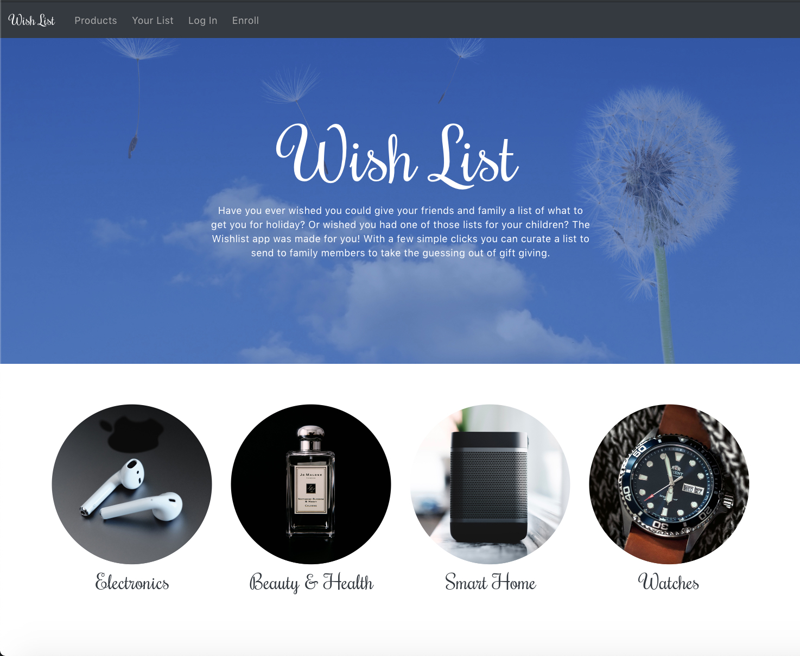
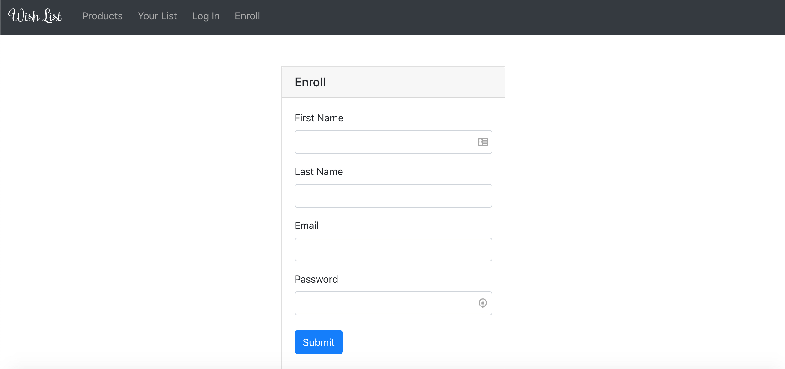

# Wish List Application
Have you ever wished you could give your friends and family a list of what to get you for holiday?Or wished you had one of those lists for your children? The Wish List app was made for you! With a few simple clicks you can curate a list to send to family members to take the guessing out of gift giving.

# DEPLOYED SITE 
https://wishlist2019.herokuapp.com/

## TECHNOLOGIES USED
<ul>
<li>JavaScript</li>
<li>Nodejs</li>
<li>Google API</li>
<li>React</li>
<li>Sequelize</li>
<li>Heroku</li>
<li>Node Packages</li>
    <ul>
        <li>reactStrap</li>
        <li>Express</li>
        <li>passport</li>
        <li>Moment</li>
        <li>Node-Spotify-api</li>
    </ul>
</ul>

## USE AND SCREENSHOTS:
The user can log in to the application and create their own wishlist from a list of products available through the app. They can then share their list with others or find the the items available for purchase from Walmart. 

### Home Page

### Enroll Page

### YourList Page

## CONTRIBUTORS
Steven Keen
Chris Ross
Vijayalakshmi Sethuram
Alicia Tamboli